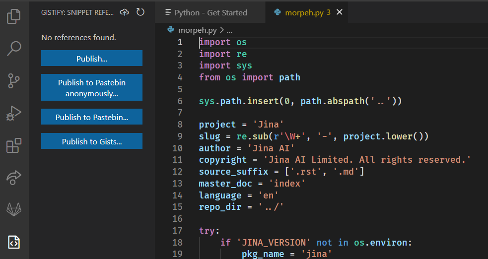
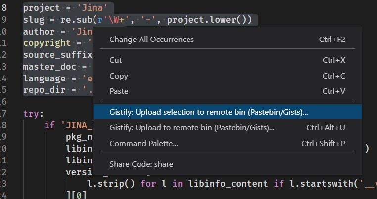
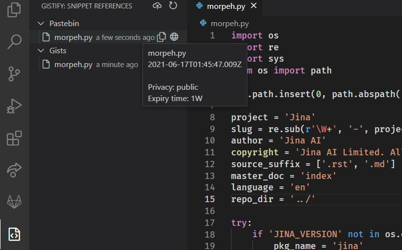
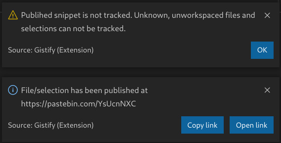

## Gistify &nbsp;     

Reliable extension to upload snippets to GitHub Gists and Pastebin for Visual Studio Code. Created by [@gvsem](https://github.com/gvsem) and [@jvstme](https://github.com/jvstme)

## Configuration

### GitHub Gists

You need to retrieve access token from GitHub to publish Gists:

* `gistify.gists.userToken`: API token with `gist` permission must be received at [GitHub Tokens](https://github.com/settings/tokens/new)

### Pastebin

You need to retrieve access token from Pastebin to publish snippets:

* `gistify.pastebin.apiToken`: API token must be received at [Pastebin Docs / Your Unique Developer API Key](https://pastebin.com/doc_api#1)

## Features

Gistify can upload your snippets. Use our menu:

You can do selections and publish them:

Track your snippets in a convenient way:

> Notice: you can not track several types of files. 

-----------------------------------------------------------------------------------------------------------

## Known Issues

Visit our [Issues](https://github.com/gvsem/gistify/issues) to submit any detected problem.

## Release Notes

### Requested features

* OAuth authorization with GitHub
* Disable manuak app token generation

### 1.0.1

Design fixes & CI/CD updates

### 1.0.0

Initial release of Gistify.
* Upload snippets at Pastebin and Gists (Ctrl+Alt+U)
* Upload selections using RBM in editor
* Track uploaded snippets in View
